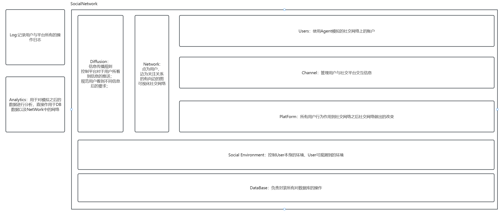

### 需求说明
+ 实现基本社交网络多智能体模拟
+ 要求满足大规模、智能化
+ 各部分模块化，方便后期增加
### 模块设计

+ Users:用户模块
+ PlatForm：社交平台模块
+ Channel：用户与社交平台沟通模块
+ SocialGraph：社交网络连接图模块
+ Diffusion：社交网络信息传播定义模块
+ Environment：用户环境与公共环境维护模块
+ Database：DB数据库操作模块
+ Log:平台与用户日志记录模块
+ Analysis：数据分析模块

### 基本环境
python == 3.10
